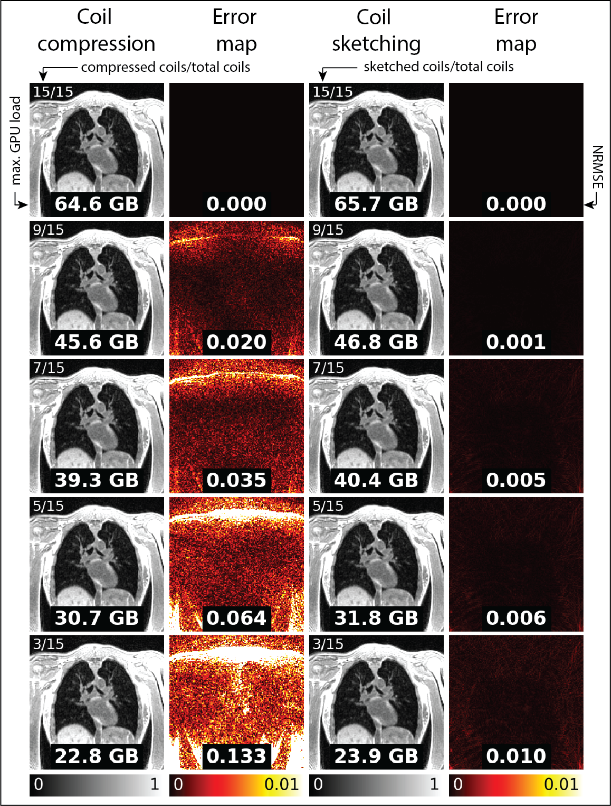

---

**4D MRI Reconstruction via Coil Sketching**  
**Author:** Joseph Plummer

This repository contains experimental code for coil sketching-based reconstruction of 4D MRI datasets. It builds upon the excellent open-source framework developed by Julio Oscanoa et al., available at: [https://github.com/julioscanoa/sketching_mri](https://github.com/julioscanoa/sketching_mri). We are grateful for their foundational work.

> ⚠️ **Note:** This is an active research repository and remains under constant development. Contributions and feedback are welcome.

---

## 🚧 **TODO**

> **This section highlights upcoming tasks and planned improvements for this repository.**

1. ~~Provide a sample 4D dataset (currently pending, will be uploaded soon)~~
2. ~~Release clean version of the code~~
3. ~~Release test scripts~~
4. ~~Link to paper once DOI released~~
5. Upload a live video demo.

---

## Installation

To set up the environment and run the experiments, execute the following commands in order:

```bash
mamba update -n base -c defaults mamba
make mamba
mamba activate coil-sketching-4d
make pip
```

> ⚠️ **Note:** We recommend installing via mamba instead of conda, as it has faster performance when handling Cuda-related packages. Feel free to replace all instances of `mamba` with `conda` inside the Makefile if you would prefer to use conda.

### Troubleshooting

This repository was developed and tested on systems with NVIDIA GPUs. If you are installing on a CPU-only system or one without CUDA support, remove the following GPU-specific dependencies from `environment.yaml`:

- `cudnn`
- `nccl`
- `cupy`

---

## Data download

To download the sample data, please run the `download_data.py` script. Alternatively, you can manually download the data files from: [https://zenodo.org/records/15802530](https://zenodo.org/records/15802530). Please store them inside the `data/` directory if you download the data manually.

---

## Development Workflow

If you intend to modify or extend the code, please work from a new development branch:

```bash
git checkout -b author-name-dev
```

Issue submissions and changes are encouraged.

---

## Uninstallation

To clean up the environment:

```bash
mamba activate
make clean
```

---

## Publication

Manuscript located here: [https://onlinelibrary.wiley.com/doi/10.1002/mrm.70169](https://onlinelibrary.wiley.com/doi/10.1002/mrm.70169)

J. W. Plummer, P. Daudé, A. Tsakirellis, et al., “ Coil Sketching for Fast and Efficient 4D Lung MRI Reconstruction,” Magnetic Resonance in Medicine (2025): 1–13, [https://doi.org/10.1002/mrm.70169](https://doi.org/10.1002/mrm.70169). 
